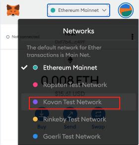
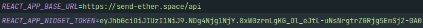
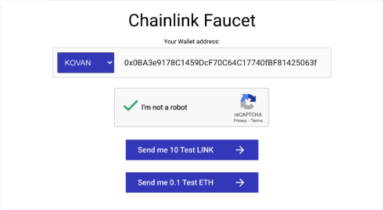
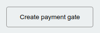
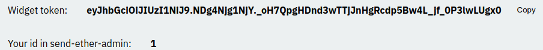
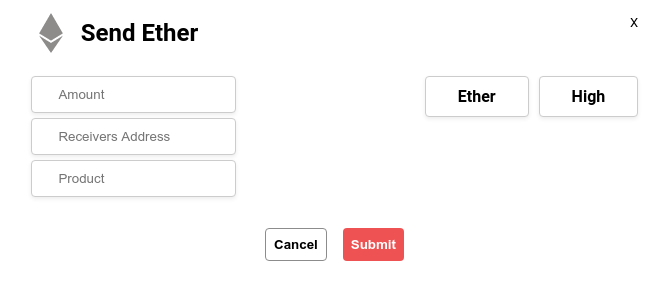
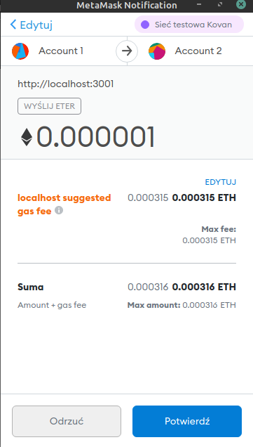

# Getting Started with send-ether widget

send-ether widget is a button which can be used as a payment gate for your online shop, website, mobile app. All you need is payment gate that you can setup on admin website which I prepared.

This is a test environment for developers, in the future it will be full-fledged npm dependency.

### Initial Setup
However, to get started with send-ether widget, you must ensure that you have few things installed and configured.
#### MetaMask
1. Download and install [MetaMask](https://metamask.io/), a browser extension that you’ll use as a wallet for interacting with your smart contracts, and the Ethereum network. MetaMask requires either [Google Chrome](https://www.google.com.au/intl/en_au/chrome/) or [Brave browser](https://brave.com/), and also has limited support for Firefox and Opera. I recommend Chrome or Brave.
2. Open your MetaMask browser extension (look for the fox symbol in your extensions on the top right of the browser), and [setup your account](https://www.youtube.com/watch?v=4ZgFijd02Jo).
3. Once your account is setup, change the Ethereum network that MetaMask is connected to, to the Kovan Testnet by selecting the dropdown at the top, and changing it to ‘Kovan Test Network’.

   

#### NodeJS

Minimum Required Version : 12.0.0
Minimum Windows O/S Version: 10
Minimum macOS version: 10

You can skip this step if you already have a working Node.js 12.0 or greater installation. To check this, you can open a new Terminal/Windows Command Prompt (or another CLI of your choice), type the command below and press enter.

      node -v

If you don’t have Node.js installed, download and install the latest version of the JavaScript runtime environment [Node.js and package manager NPM](https://nodejs.org/en/download/). Accept all default answers for questions.

#### Git

Download and install the distributed revision control system [Git](https://git-scm.com/downloads). You will need this when installing packages. Accept all default values during installation. If you’re using macOS and you get prompted to install ‘command line developer tools’, accept and install them.

To test git once it’s installed, open a new Terminal/Windows Command Prompt (or another CLI of your choice), and type the command below:

      git --version

#### Text Editor

Go to [https://code.visualstudio.com/](https://code.visualstudio.com/), download and install the latest version of Visual Studio Code for your operating system.

### Funding Your MetaMask Account

1. Open MetaMask, move the cursor over your account name, and click on it to copy the wallet address to the clipboard

   

2. Head to [https://linkfaucet.protofire.io/kovan](https://linkfaucet.protofire.io/kovan), paste in your wallet address and press the ‘Send me 0.1 Test ETH button. The faucet will send you some Kovan Testnet ETH, which should show up in your MetaMask wallet a few seconds after in the Assets section.

   

## Additional steps

### Interacting with widget

Take note, send-ether widget is a button that can be added to your website/internet shop but in order for it to work it needs active payment gate. We're going to do that in next steps.

1. Go to [send-ether.space](https://send-ether.space). This is the admin website created for the purpose of tracking transactions made with send-ether widget.
2. Login with your GitHub account
3. On Account page you will see some basic information from GitHub account, and a button to create a payment gate. To create it simply click it and when asked provide name for the gate.

   

4. Now you can go to 'Payment Gates' screen. Listed there you will find all your gates. Remember, to make use of the Widget you will need Widget Token and your User Id which should look something like this:

   

5. In root directory, create file .env and fill it with your widget token and base url like so:

   

6. From now on the widget will be assigned to your Payment Gate. You can now use it to transfer test Ether.

### Making transactions with send-ether widget

Now that everything is set up you can make transactions with send-ether.
Open the project with:

      npm run start 

and interact with the button.

Provide necessary information (remember that Amount, Receivers Address and Product Name are needed).
For testing purposes you can use one of my addresses:

**0x1D5630816c9c5C1547Cc5745E195E45525C58737**

I created two accounts for myself and just send ether between them.

When all the information is provided, MetaMask will ask you about the transaction.

Once confirmed, wait for Pacman to finish, and the transaction will complete.
You can view all your transactions on admin site.

Widget can be used on multiple sites without problems, all you need is token per website for it to function properly.

### TODO

1. Implementation of ECR20 token transactions
2. Adding customization of the button with parameters.
3. Registering the app as npm package   
3. UI refactor for admin website
4. Additional features like: cryptocurrency news etc...
